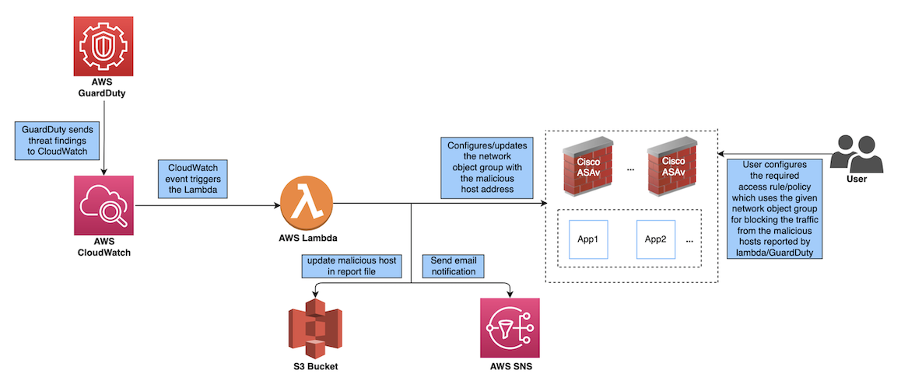

# **Cisco ASAv - AWS GuardDuty Integration**
  Cisco provides set of Scripts and CloudFormation Templates to allow the integration the AWS GuardDuty Service with Cisco ASAv (Adaptive Security Appliance Virtual).

  Amazon GuardDuty is a monitoring service which processes data from various sources in AWS environment (VPC Logs, CloudTrail management event logs, CloudTrail S3 data event logs, DNS logs etc.) and identifies potentially unauthorized and malicious activity in the AWS environment. <br><br>
  This solution make use of the threat analysis data/results from Amazon GuardDuty (malicious IPs generating threats, attacks etc.) and feeds the information(malicious IP) to the Cisco Adaptive Security Appliance (ASAv) to protect the underlying network and applications against future threats originating from these sources(IP).<br>

  This solution makes use of several AWS services, including GuardDuty, CloudWatch, Lambda, S3 Bucket, SNS, etc.
  This is a complete serverless implementation (i.e. no helper VMs involved in this feature).<br>

  All this is achieved using a lambda function which is triggered by a CloudWatch event when the finding is raised by AWS GuardDuty.
  * The findings detected by GuardDuty will be processed (analysed and filtered) based on pre-defined criteria like severity, direction attribute(INBOUND only), availability of malicious IP, etc. in the GuardDuty finding.
  * Once the finding is processed, we will get the remote IP which caused the GuardDuty alert, this IP will be considered malicious IP.
  * In next step, the network object group on the ASAv is created/updated with the malicious IP found after processing.
  Note that the scope of lambda is limited only to update the network object group with the malicious host IP and usage of this object in ACL/ACE for blocking the traffic will be the user’s responsibility.<br>

  Apart from updating the network object group on ASAv(s) the lambda function also:
  * Creates a report file in the S3 bucket containing all the IPs processed by it
  * Sends a mail notification to the administrator regarding the various updates carried out by the lambda function

  *Disclaimer: It is required to have prior understanding of Cisco ASAv, AWS resources & deployments.*
  <br><br>

## **How the Cisco ASAv – AWS GuardDuty Integration Solution Works**

Figure below depicts the various components involved in the solution and how they interact with each other to complete the solution.
  <br><br>
  
  <br>*Figure: Cisco ASAv - AWS GuardDuty Integration Design*
  <br>

The AWS GuardDuty service reports a finding, based on the finding reported a CloudWatch event rule(which monitors the GuardDuty findings) triggers the AWS Lambda function.<br>
Once the AWS Lambda functions runs, it performs the below actions:
1.	Process the reported finding to verify that all the required criteria are met(severity, INBOUND connection direction, presence of malicious IP, not a duplicate finding etc.)
2.	Update the network object group(s) on the ASAv(s) (as per the input configuration) with the malicious IP
3.	Update the malicious IP in the report file on S3 bucket
4.	Send a mail notification to the administrator regarding the various ASAv updates(and/or any errors)

The lambda function only updates the network object group(s) on the ASAv(s) and user is responsible for creating any ACL rule/entry which uses the updated network object group.<br><br>
Note that, this will be needed only once. Because once the ACL rule/entry is configured with the object group, future updates will update the object group and there won’t be any need to update the ACL rule/entry.

## **Solution Deployment Steps**
  **Note**: <br>
    AWS Services used in this solution are region specific(GuardDuty, lambda, etc.), therefore ensure that all the  resources are in same region.<br><br>
  1. Ensure that GuardDuty Service is enabled on the AWS.<br>
     To enable the service from AWS console:
      ```
      AWS Console --> Services --> GuardDuty --> Try GuardDuty for free / Get Started --> Enable GuardDuty
      ```

  2. Download the scripts and template for the solution are from the GitHub repository.<br>
     Repo URL: \<Public REPO URL> <br>
     Clone the repository:
     ```
     git clone <Public REPO URL>
     ```
     Repository contents:<br>
     ```
     /
     - README.MD
     - configuration/ => ASAv Configuration file template
     - images/
     - lambda/    => lambda function python files
     - templates/ => cloud formation template for deployment
     ```

  3. ASAv Configurations
      1. Create the network object group for the hosts reported by the GD/lambda.<br>
         You may have to create the object group with a dummy IP in order to use this object group in a ACL/ACE.<br>
         You can create multiple network object groups to be updated.
         ```
         object-group network aws-gd-suspicious-hosts
            description Malicious Hosts reported by AWS GuardDuty
            network-object host 12.12.12.12
         ```
         <br>In case you don’t create this beforehand, the lambda function will create and update the malicious IPs in a network object group with the default name: ```aws-gd-suspicious-hosts```

      2. Create appropriate ACL/ACE to block the traffic using the above network object group<br>
         The below example is just a sample for reference.
          ```
          access-list out-iface-access line 1 extended deny ip object-group aws-gd-suspicious-hosts any
          ```

      3. Create a separate user(e.g. aws-gd) on ASAv to be used by lambda function for configuration updates
          ```
          username aws-gd password MyPassword@2021 privilege 15
          username aws-gd attributes
          service-type admin
          ```
          **Note:**<br>
            Please note that, latest ASAv versions will force the new user to reset the password on first login to the ASAv. <br>
            Therefore you will have to update the CLI configured password. <br>
            So after configuring the new user and password on ASAv CLI, confirm the login to ASAv with new user and update the password (when prompted).<br>
            Also, verify that enable password works as expected.<br>

            Finally configure this updated user password and enable password in ASAv configuration input file. (next step)

      4. Encrypt the password(s) and enable password(s) (*optional*)<br>
         If you are providing encrypted password, then please note that:
         * Encryption using the Symmetric KMS keys is only supported.
         * All the passwords in the ASAv configuration file must be encrypted using the same KMS key.
            You may use the below command to generate encrypted passowrd:
            ```
            aws kms encrypt --key-id <KMS-ARN> --plaintext <password>
            ```
            Encrypted Password is value of **CiphertextBlob** in above command output.<br><br>
            You will need the AWS CLI installed and configured to run the above command.<br>
            Please refer the AWS CLI documentation for more details: [AWS Command Line Interface](https://docs.aws.amazon.com/cli/latest/userguide/cli-chap-welcome.html)


         * The ARN of the KMS key should be provided as the parameter during deployment of CloudFormation template

         * Both Password and Enable Password must be encrypted
         <br><br>

      5. Create the ASAv configuration input file<br>
         Refer the template config file available under **configuration** folder: ```configuration/asav-config-input.ini```<br>
         <br>
         Below are the various ASAv details needed:
          ```
          [asav-1]  ==>   Section name: Unique ASAv Identifier (within the file)
          public-ip=<Public IP of ASAv>
          username=<Username on ASAv>
          password=<Password (plaintext/encrypted using KMS)>
          enable-password=<Enable Password (plaintext/encrypted using KMS)>
          object-group-name=<Network Object Group Name(s) to be updated with malicious host IP (comma separated values)>
          ```

         Note:
            1. Before configuring the credentials (username, password, enable password) for various ASAv devices in the configuration file, please ensure that login works properly using these credentials.
            2. Ensure that the entry/section for an ASAv device is added only once in the configuration file, multiple entries for same device may cause race conditions and nondeterministic behavior as lambda will work on to update all the devices simultaneously.<br>
            In case multiple network object group updates are needed on single device, same can be configured as comma separated values for the ```object-group-name``` attribute.
   <br><br>

  4. Prepare the lambda function zip file.<br>
     Create the zip file: ```asav-gd-lambda.zip``` from the files in **lambda** folder.
      ```
      $ cd lambda
      $ zip asav-gd-lambda.zip *.py
      adding: asav.py (deflated 73%)
      adding: aws.py (deflated 74%)
      adding: main.py (deflated 70%)
      adding: utils.py (deflated 61%)
      $
      ```

  5. Prepare the lambda layer zip file<br>
     The lambda layer file: ```asav-gd-lambda-layer.zip``` can be created on a Linux environment, such as Ubuntu 22.04 with Python 3.9 installed.
      ```
      mkdir -p layer
      virtualenv -p /usr/bin/python3.9 ./layer/
      source ./layer/bin/activate
      pip3.9 install cffi==1.15.0
      pip3.9 install cryptography==37.0.2
      pip3.9 install paramiko==2.7.1
      mkdir -p ./python/.libs_cffi_backend/
      cp -r ./layer/lib/python3.9/site-packages/* ./python/
      zip -r asav-gd-lambda-layer.zip ./python
      ```
     _Note: Install python3.9 and its dependencies(as shown below) for creating the layer._
     ```
     $ sudo apt update
     $ sudo apt install software-properties-common
     $ sudo add-apt-repository ppa:deadsnakes/ppa
     $ sudo apt install python3.9
     $ sudo apt install python3-virtualenv
     $ sudo apt install zip
     $ sudo apt-get install python3.9-distutils
     $ sudo apt-get install python3.9-dev
     $ sudo apt-get install libffi-dev
     ```
     
  6. Create a S3 bucket and upload all the artifacts:
      * ASAv Configuration file: ```asav-config-input.ini```
      * Lambda layer zip file: ```asav-gd-lambda-layer.zip```
      * Lambda function zip file: ```asav-gd-lambda.zip```
      <br><br>

  7. Deploy the CloudFormation template provided in the templates folder.<br>
      * **Parameters for CloudFormation Template**<br>
        The following input parameters should be collected prior to deployment.<br>

         | Sr. No. | Parameter                                   | Description                                                                                                                                                                                                                                                                                                                                                     |
         | ------- | ------------------------------------------- | --------------------------------------------------------------------------------------------------------------------------------------------------------------------------------------------------------------------------------------------------------------------------------------------------------------------------------------------------------------- |
         | 1.      | Deployment name*                             | This will be used as prefix for all the resources created by the cloud formation template. <br>e.g. `cisco-asav-gd`                                                                                                                                                                                                                                                                      |
         | 2.      | Minimum severity level of GD finding*        | Minimum GuardDuty findings severity level to be considered for processing[1.0 to 8.9]. <br> Any GuardDuty finding reported with lesser severity than this will be ignored.<br> Severity classification, Low: 1.0 to 3.9, Medium: 4.0 to 6.9, High: 7.0 to 8.9. <br>e.g. `4.0`                                                                                                                                                                                        |
         | 3.      | Administrator email ID*                      | Administrator email address to receive notifications regarding ASAv updates done by lambda function. <br>e.g. `abc@xyz.com`                                                                                                                                                                                                                                                             |
         | 4.      | S3 Bucket name*                              | S3 Bucket name containing the files (lambda function zip,  lambda layer zip and/or ASAv details file). <br>e.g. `asav-gd-bucket`                                                                                                                                                                                                                                                                                |
         | 5.      | S3 Bucket folder/path prefix                | S3 Bucket path/folder containing the config files, leave empty if there is no folder. <br>e.g. `"", "cisco/asav-gd/"`                                                                                                                                                                                                                                               |
         | 6.      | Lambda layer zip file name*                  | Lambda layer zip file name.<br>e.g. `asav-gd-lambda-layer.zip`                                                                                                                                                                                                                                                                                                                                      |
         | 7.      | Lambda function zip file name*               | Lambda function zip file name. <br>e.g. `asav-gd-lambda.zip`                                                                                                                                                                                                                                                                                                                                  |
         | 8.      | ASAv configuration file name*                | `*.ini` file containing ASAv(s) configuration details. (Public IP, username, password, enable password, network object group names, etc.) <br>e.g. `asav-config-input.ini`                                                                                                                                                                                                                       |
         | 9.      | ARN of KMS key used for password encryption | ARN of an existing KMS (AWS KMS key used for password encryption).<br>Leave empty in case plain text passwords are provided in the ASAv configuration input file.<br>If specified, all the passwords and enable passwords mentioned in the ASAv configuration input file must be encrypted.<br>The Passwords must be encrypted only using the specified ARN.<br>Generating encrypted passwords: <br>```aws kms encrypt --key-id <KMS ARN> --plaintext <password>``` <br>e.g. `arn:aws:kms:<region>:<aws-account-id>:key/<key-id>` |
         | 10. | Enable/Disable debug logs* | Enable/Disable lambda function debug logs in CloudWatch. <br>e.g. `enable or disable` |

         `*`: denotes the mandatory parameters.
         <br>

      * **Deploy the stack**<br>

         After all of the pre-requisites are completed for deployment, you can create the AWS CloudFormation stack. <br>
         Use the template file in the target directory: `templates/cisco-asav-gd-integration.yaml` <br>
         Provide the parameters as collected in previous step. <br><br>
         **Deployment:**
         ```
         AWS Console --> Services --> CloudFormation --> Stacks --> Create stack (with new resources) --> Prepare template(Template is ready) --> Specify template --> Template source(Upload a template file) --> \<update parameters> --> Create Stack
         ```
         Please refer AWS Documentation for deployment of CloudFormation template.<br>
         [AWS Documentation](https://docs.aws.amazon.com/AWSCloudFormation/latest/UserGuide/GettingStarted.html)
         <br>

      * Subscribe to the email notifications <br>
        Once the CloudFormation template is successfully deployed, you will receive a SNS notification mail(on configured email ID) requesting you to subscribe.<br>
        You should subscribe to the same using the link provided in the mail.

## **Resources Created**
   Following resources are created by the CloudFormation template:
   * **AWS::SNS::Topic** : SNS Topic for publishing the email notifications.
   * **AWS::Lambda::Function, AWS::Lambda::LayerVersion** : Lambda function and lambda layer resources using the corresponding the zip file provided.
   * **AWS::Events::Rule** : CloudWatch event rule to trigger the lambda function based on the GuardDuty findings event.
   * **AWS::Lambda::Permission** : Permission for CloudWatch event rule to trigger the lambda function.
   * **AWS::IAM::Role, AWS::IAM::Policy** : IAM role and policy resources to allow various access permissions to the lambda function for various AWS resources involved.(S3, SNS, CloudWatch logs, KMS, etc.)

   <br>

## **Deployment Verification** (optional)
   Once the CloudFormation Deployment is completed, you may verify the deployed solution using below steps.
   1. Fetch the GuardDuty detector ID from AWS Console
      ```
      AWS Console --> Services --> GuardDuty --> Settings --> About GuardDuty --> Detector ID
      ```

   2. In case of newly enabled service the findings list in GuardDuty console will be empty.<br>
      Therefore, generate the sample GuardDuty finding using the below cmd(s).
      ```
      aws guardduty create-sample-findings --detector-id <detector-id> --finding-types <GuardDuty-Finding types to be generated>

      aws guardduty create-sample-findings --detector-id <detector-id> --finding-types UnauthorizedAccess:EC2/MaliciousIPCaller.Custom
      ```
      Note that the severity of the sample finding should be grater than the minimum severity level.
      `UnauthorizedAccess:EC2/MaliciousIPCaller.Custom` finding is raised with severity level 5 (Medium).<br>

      You will need the AWS CLI installed and configured to run the above command. <br>
      Please refer the AWS CLI documentation for more details: [AWS Command Line Interface](https://docs.aws.amazon.com/cli/latest/userguide/cli-chap-welcome.html)

   3. You should see the sample finding in the findings list on GuardDuty console. <br>
      The Sample findings will contain the prefix: `[sample]` <br>
      You may check the sample finding details. (attributes: like connection direction, remote IP etc.)

   4. Now wait for the lambda function to run, it may take up to 5 mins for GuardDuty finding CloudWatch to trigger the lambda.<br>
      Note that, the update interval for new GuardDuty findings to CloudWatch Event is 5 mins. And for updated findings, based on configuration it may take more time(15 mins / 1 hr / 6hrs).

   5. Once the lambda is invoked, you may verify the below:
      1. You should receive the mail with the details regarding GuardDuty finding received and NGFWv manager updates done by the lambda.

      2. You should verify the report file in the generated in the S3 bucket.<br>
         It should contain the malicious IP entry as reported by the sample GuardDuty finding.<br>
         Report file name: `<deployment-name>-report.txt`

      3. You should verify that the network object group(s) are updated on the the configured ASAv(s) with the malicious IP reported from the sample finding.

      4. You should verify the report file in the generated in the S3 bucket. It should contain the malicious IP entry.<br>
         Report file name: `<deployment-name>-report.txt`

      5. You may also verify the lambda logs in CloudWatch console.<br>
         CloudWatch Log Group Name: `<deployment-name>-lambda`
         ```
         AWS Console --> Services --> CloudWatch --> Logs --> Log groups --> select the log group
         ```

   6. Sample finding data cleanup
      Once the above details are verified, you must clean up the data generated by the sample finding
      1. On GuardDuty console Archive the sample finding
         ```
         AWS Console --> Services --> GuardDuty --> Findings --> Select the finding --> Actions --> Archive
         ```

      2. Clean up the ASAv(s) by removing the malicious IP added in the network object groups.

      3. Clean up the report file in S3 bucket. <br>You may update the file by removing the malicious IP reported by the sample finding.
   <br><br>

## **Updating Deployment Configuration**
   Post deployment you may update the various deployment configurations. <br>
   Please refer the table below for more details on the same.<br>

   | Sr. No. | Update Parameter                            | Procedure for configuration parameter                                                                                                                                                       |
   | ------- | ------------------------------------------- | ------------------------------------------------------------------------------------------------------------------------------------------------------------------------------------------- |
   | 1.      | ASAv configuration file name                | Update the file in S3 bucket. You may update the file with same name as previous one.<br> Incase filename is modified, then update the Parameter via **Update stack** action on AWS Console.  |
   | 2.      | Lambda layer zip file name                  | Update the zip file in S3 bucket with a new name and then update the Parameter via **Update stack** action on AWS Console. |
   | 3.      | Lambda function zip file name               | Update the zip file in S3 bucket with a new name and then update the Parameter via **Update stack** action on AWS Console.|
   | 4.      | Minimum severity level of GD finding        | Use the **Update stack** action on AWS Console to update the parameter value.                                                                                                                 |
   | 5.      | Administrator email ID                      | Use the **Update stack** action on AWS Console to update the parameter value.<br> You may also add/update subscriptions via SNS service console.                                              |
   | 6.      | ARN of KMS key used for password encryption | Use the **Update stack** action on AWS Console to update the parameter value.                                                                                                                 |
   | 7.      | Enable/Disable debug logs                   | Use the **Update stack** action on AWS Console to update the parameter value.                                                                                                                 |

   <br>Update stack action for an already deployed stack is available on AWS Console.
   ```
   AWS Console --> Services --> CloudFormation --> Stacks --> <Stack name> --> Update (Update Stack) --> Prepare template --> Use current template --> Next --> <update parameters> --> Update Stack
   ```
   <br>

## **References**
   * [Cisco ASAv - AWS GuardDuty User Configuration Guide](./Cisco_ASAv_AWS_GuardDuty_Integration_User_Configuration_Guide.pdf)
   * [AWS GuardDuty](https://aws.amazon.com/guardduty/)
   * [CloudWatch Events notification frequency for GuardDuty](https://docs.aws.amazon.com/guardduty/latest/ug/guardduty_findings_cloudwatch.html#guardduty_findings_cloudwatch_notification_frequency)
   * [AWS CloudFormation](https://docs.aws.amazon.com/AWSCloudFormation/latest/UserGuide/GettingStarted.html)
   * [AWS Command Line Interface](https://docs.aws.amazon.com/cli/latest/userguide/cli-chap-welcome.html)
   * [Cisco ASA CLI Configuration Guide](https://www.cisco.com/c/en/us/td/docs/security/asa/asa916/configuration/general/asa-916-general-config.html)
   * [Cisco ASAv Resources](https://www.cisco.com/c/en/us/support/security/virtual-adaptive-security-appliance-firewall/series.html)

   <br>

## **Licensing Info**
This project is licensed under the Apache License, Version 2.0 - see the LICENSE file for details.

<br>

## **Copyright**
Copyright (c) 2021 Cisco Systems Inc and/or its affiliates.

<br>